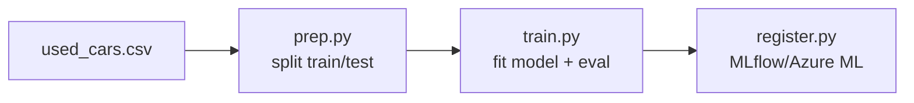

# MLOps: Used-Car Price Prediction (Azure ML + GitHub Actions)

Automate an end-to-end pricing workflow for a car dealership using Azure Machine Learning and CI/CD.
This repo includes data prep, model training, evaluation, and model registration, wired for pipelines and GitHub Actions.

---

## 📌 Problem Statement (Business Context)

An automobile dealership in **Las Vegas** sells luxury and non-luxury vehicles with diverse specs (mileage, engine, seating, etc.). Manual pricing is error-prone, slow to update, and hard to scale—hurting revenue and customer trust.

**Goal:** Build a robust **MLOps pipeline** that:

* Cleans and preprocesses data
* Trains and evaluates a model for price prediction
* Registers the model for deployment
* Enables **CI/CD** for continuous integration and delivery

**Outcomes:** Improved pricing accuracy, operational efficiency, and scalability.

---

## 🧾 Data Description

Source file: `data/used_cars.csv` (price is in lakhs)

| Column              | Type        | Description                                   |
| ------------------- | ----------- | --------------------------------------------- |
| `Segment`           | categorical | Vehicle category (e.g., luxury / non-luxury). |
| `Kilometers_Driven` | numeric     | Total kilometers driven.                      |
| `Mileage`           | numeric     | Fuel efficiency (km/l).                       |
| `Engine`            | numeric     | Engine capacity (cc).                         |
| `Power`             | numeric     | Engine power (BHP).                           |
| `Seats`             | numeric     | Number of seats.                              |
| `Price`             | numeric     | Target — vehicle price (in lakhs).            |

---

## 🗂️ Repository Structure

```
gl-mlops-prj3-main/
├─ .github/workflows/
│  ├─ custom-create-compute.yml
│  ├─ custom-register-dataset.yml
│  ├─ custom-register-environment.yml
│  ├─ custom-run-pipeline.yml
│  └─ deploy-model-training-pipeline-classical.yml
├─ data/
│  └─ used_cars.csv
├─ data-science/
├─ environment/
│  └─ train-conda.yml
├─ src/
│  ├─ prep.py        # split raw CSV → train/test folders
│  ├─ train.py       # train & evaluate model, save MLflow model
│  └─ register.py    # register model in MLflow/Azure ML
└─ mlops/azureml/train/
   ├─ data.yml
   ├─ newpipeline.yml
   ├─ train-env.yml
   ├─ train.yml
   └─ config-infra-prod.yml
```

---

## 🔄 Pipeline Overview



* **`prep.py`**
  Reads `data/used_cars.csv`, drops fully-empty rows/cols, splits into train/test using `--test_train_ratio`, and writes CSVs into mounted output folders (AzureML-friendly).
* **`train.py`**
  Builds a `Pipeline(Preprocessor + RandomForestRegressor)` using `scikit-learn`. Logs metrics (MAE, R²) with MLflow and saves an MLflow-compatible model directory.
* **`register.py`**
  Registers the saved model directory to the MLflow Model Registry / Azure ML registry.

---

## 🚀 Quickstart (Local)

> Ensure Python 3.8+ and `conda`/`venv`. You can also use `environment/train-conda.yml`.

```bash
# 1) Create & activate environment
conda env create -f environment/train-conda.yml
conda activate gl-mlops-train

# 2) Prepare data (train/test)
python src/prep.py \
  --data data/used_cars.csv \
  --test_train_ratio 0.2 \
  --train_data ./outputs/train \
  --test_data ./outputs/test

# 3) Train model
python src/train.py \
  --train_data ./outputs/train \
  --test_data ./outputs/test \
  --target_col Price \
  --n_estimators 200 \
  --max_depth 20 \
  --model_output ./model

# 4) (Optional) Register model
# Requires MLflow tracking server; in Azure ML jobs this is auto-configured.
python src/register.py \
  --model_name used-cars-rf \
  --model_path ./model \
  --model_info_output_path ./outputs/model_info.json
```

---

## ☁️ Azure ML (Components & Pipeline)

The `mlops/azureml/train/*.yml` files define:

* **Data prep component** → runs `src/prep.py`
* **Training component** → runs `src/train.py`
* **Registration component** → runs `src/register.py`
* **Environment** → `environment/train-conda.yml`
* **Compute & Infra** → `config-infra-prod.yml`
* **Pipeline** → `newpipeline.yml` (or `train.yml`) connects the components

Submit the pipeline via Azure ML Python SDK or CLI as per your setup (see your notebook or workflow files).

---

## 🔁 CI/CD with GitHub Actions

Workflows in `.github/workflows/` automate:

* Compute provisioning
* Dataset & environment registration
* Pipeline submission / training
* (Optional) Model registration & deployment hooks

Add your Azure credentials as GitHub secrets (e.g., `AZURE_CREDENTIALS`, workspace/subscription/resource group info) and update the YAMLs to point to your workspace, resource group, and subscription.

---

## 📊 Metrics & Tracking

* **Primary metrics:** `MAE`, `R²`
* **Logged via:** MLflow
* **Artifacts:** Trained model (MLflow format), evaluation metrics, and `model_info.json` after registration

---

## 🧰 Tech Stack

* Python, scikit-learn, pandas, numpy
* Azure Machine Learning (pipelines, jobs, model registry)
* MLflow tracking
* GitHub Actions (CI/CD)

---

## 📝 Submission Notes (per rubric)

Choose one:

1. **Full-code**

   * Submit **HTML** of the final notebook with insights.
   * Include a link to this **public GitHub** repo showing the Actions workflow.

2. **Low-code (Presentation)**

   * Submit a **PDF** presentation with problem, approach, workflow screenshots, insights, and recommendations.
   * Include a link to this **public GitHub** repo.

---

## ⚙️ Configuration

* Update Azure workspace, resource group, and subscription IDs in the workflow and AML config files.
* Ensure your datastore or dataset registration points to `data/used_cars.csv` or a blob path as required.

---

## 📄 License & Contributions

Open to improvements—PRs welcome. Add a LICENSE file if needed for your distribution policy.
